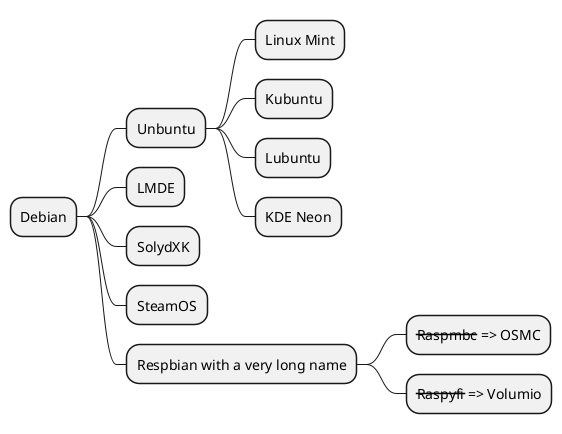

# [作图示例](https://shd101wyy.github.io/markdown-preview-enhanced/#/zh-cn/)

## 1. [Plantuml](http://plantuml.com/zh/)



## 2. [GraphViz](http://icodeit.org/2012/01/%E4%BD%BF%E7%94%A8graphviz%E7%BB%98%E5%88%B6%E6%B5%81%E7%A8%8B%E5%9B%BE/)

```viz{engine="dot"}
digraph G {
  法与道德->关系
  关系->分离
  关系->联结
  分离->法实证主义
  联结->非实证主义
  法实证主义->定义要素
  定义要素->社会实效
  定义要素->权威制定
  社会实效->法社会学
  社会实效->法现实主义
  权威制定->分析主义法学
  分析主义法学->不接受道德
  分析主义法学->接受道德
  不接受道德->排他性法律实证主义
  接受道德->包容型法律实证主义
  非实证主义->唯一制定要素
  唯一制定要素->传统自然法学
  非实证主义->三者结合
  三者结合->第三条道路
}
```

## 3. [Flow Charts](http://flowchart.js.org/)

```flow
st=>start: 法的概念争议
cond1=>condition: 是否与道德有关
op1=>operation: 实证主义法学
op2=>operation: 非实证主义法学
cond2=>condition: 首要要素
op3=>operation: 法社会学
op4=>operation: 法现实主义


st->cond1
cond1(yes)->op2
cond1(no)->op1->cond2(yes)->op3
cond1(no)->op1->cond2(yes)->op4
```

## 4. [Vega](https://vega.github.io/vega/)

```vega
{
  "$schema": "https://vega.github.io/schema/vega/v5.json",
  "width": 400,
  "height": 200,
  "padding": 5,

  "data": [
    {
      "name": "table",
      "values": [
        {"category": "A", "amount": 28},
        {"category": "B", "amount": 55},
        {"category": "C", "amount": 43},
        {"category": "D", "amount": 91},
        {"category": "E", "amount": 81},
        {"category": "F", "amount": 53},
        {"category": "G", "amount": 19},
        {"category": "H", "amount": 87}
      ]
    }
  ],

  "signals": [
    {
      "name": "tooltip",
      "value": {},
      "on": [
        {"events": "rect:mouseover", "update": "datum"},
        {"events": "rect:mouseout",  "update": "{}"}
      ]
    }
  ],

  "scales": [
    {
      "name": "xscale",
      "type": "band",
      "domain": {"data": "table", "field": "category"},
      "range": "width",
      "padding": 0.05,
      "round": true
    },
    {
      "name": "yscale",
      "domain": {"data": "table", "field": "amount"},
      "nice": true,
      "range": "height"
    }
  ],

  "axes": [
    { "orient": "bottom", "scale": "xscale" },
    { "orient": "left", "scale": "yscale" }
  ],

  "marks": [
    {
      "type": "rect",
      "from": {"data":"table"},
      "encode": {
        "enter": {
          "x": {"scale": "xscale", "field": "category"},
          "width": {"scale": "xscale", "band": 1},
          "y": {"scale": "yscale", "field": "amount"},
          "y2": {"scale": "yscale", "value": 0}
        },
        "update": {
          "fill": {"value": "steelblue"}
        },
        "hover": {
          "fill": {"value": "red"}
        }
      }
    },
    {
      "type": "text",
      "encode": {
        "enter": {
          "align": {"value": "center"},
          "baseline": {"value": "bottom"},
          "fill": {"value": "#333"}
        },
        "update": {
          "x": {"scale": "xscale", "signal": "tooltip.category", "band": 0.5},
          "y": {"scale": "yscale", "signal": "tooltip.amount", "offset": -2},
          "text": {"signal": "tooltip.amount"},
          "fillOpacity": [
            {"test": "isNaN(tooltip.amount)", "value": 0},
            {"value": 1}
          ]
        }
      }
    }
  ]
}
```

## 5. [Vega Lite](https://vega.github.io/vega-lite/)

```vega-lite
{
  "$schema": "https://vega.github.io/schema/vega-lite/v4.json",
  "data": {
    "url": "https://vega.github.io/vega-lite/data/flights-2k.json",
    "format": {"parse": {"date": "date"}}
  },
  "transform": [{"calculate": "hours(datum.date)", "as": "time"}],
  "repeat": {"column": ["distance", "delay", "time"]},
  "spec": {
    "layer": [{
      "selection": {
        "brush": {"type": "interval", "encodings": ["x"]}
      },
      "mark": "bar",
      "encoding": {
        "x": {
          "field": {"repeat": "column"},
          "bin": {"maxbins": 20},
          "type": "quantitative"
        },
        "y": {"aggregate": "count", "type": "quantitative"},
        "color": {"value": "#ddd"}
      }
    }, {
      "transform": [{"filter": {"selection": "brush"}}],
      "mark": "bar",
      "encoding": {
        "x": {
          "field": {"repeat": "column"},
          "bin": {"maxbins": 20},
          "type": "quantitative"
        },
        "y": {"aggregate": "count", "type": "quantitative"}
      }
    }]
  }
}
```

# Vega-Lite Tutorial

1. `data` 属性定义了待可视化的源数据

2. Vega-Lite 中的基础图形元素为 `marks`，它提供了可以用来可视化编码后的数据的基本形状

```vega-lite
{
    "data": {
        "values": [
            {"a": "C", "b": 2},
            {"a": "C", "b": 7},
            {"a": "C", "b": 4},
            {"a": "D", "b": 1},
            {"a": "D", "b": 2},
            {"a": "D", "b": 6},
            {"a": "E", "b": 8},
            {"a": "E", "b": 4},
            {"a": "E", "b": 7}
        ]
    },
    "mark": "point",
    "encoding": {
        "x": {"field": "a", "type": "nominal"},
        "y": {"field": "b", "type": "quantitative"}
    }
}
```